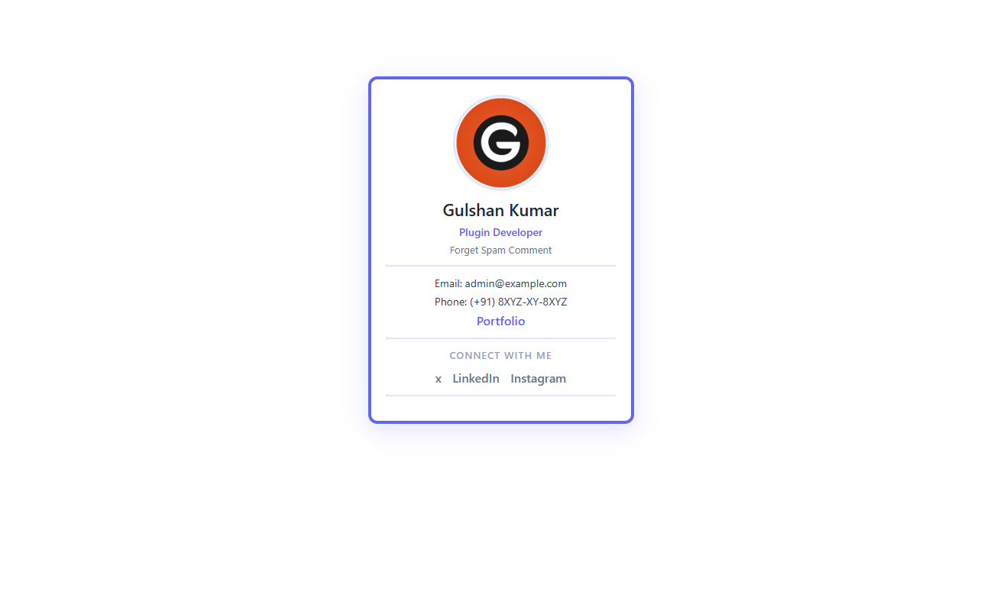

<div align="center">

<!-- Banner / Hero -->


<br />
<br />

# 🪪 Business Card

**A clean, responsive digital business card built with pure HTML & CSS**

[](https://validator.w3.org/)
[](https://jigsaw.w3.org/css-validator/)
[](LICENSE)
[](https://developer.mozilla.org/en-US/docs/Web/HTML)
[](https://developer.mozilla.org/en-US/docs/Web/CSS)
[](https://developer.mozilla.org/en-US/docs/Web/JavaScript)

</div>

---

## ✨ Overview

A minimal yet elegant **digital business card** component crafted entirely with semantic HTML5 and modern CSS3 — no frameworks, no JavaScript, no dependencies. Just clean, standards-compliant code that works everywhere.

> 🎯 **Goal:** Showcase frontend fundamentals — semantic markup, CSS box model, responsive design, and visual polish — in one self-contained component.

---

## 🖼️ Preview

<div align="center">
  
</div>

---

## 🚀 Features

- ✅ **Zero dependencies** — Pure HTML & CSS, no build tools required
- ✅ **W3C validated** — Both HTML5 and CSS3 pass official W3C validators
- ✅ **Semantic markup** — Accessible, meaningful HTML structure
- ✅ **Responsive** — Adapts gracefully to all viewport sizes
- ✅ **Gravatar integration** — Dynamic avatar via Gravatar CDN
- ✅ **Smooth hover states** — Subtle interactive feedback on links
- ✅ **Mobile-friendly** — `viewport` meta and fluid sizing built in

---

## 📁 Project Structure

```
business-card/
├── index.html        # Semantic HTML5 markup
├── styles.css        # All styling — layout, colors, typography
├── preview.png       # Screenshot for README / social preview
└── README.md         # You're here!
```

---

## 🛠️ Getting Started

No installation. No build step. Just open it.

```bash
# 1. Clone the repo
git clone https://github.com/your-username/business-card.git

# 2. Navigate into it
cd business-card

# 3. Open in your browser
open index.html
```

Or simply drag `index.html` into any browser tab. ✅

---

## 🎨 Customisation

All personal details live inside `index.html`. Swap out what you need:

| Field | Location | Example |
|---|---|---|
| Name | `.full-name` `<p>` | `Gulshan Kumar` |
| Designation | `.designation` `<p>` | `WordPress Plugin Developer` |
| Company | `.company` `<p>` | `Forget Spam Comment` |
| Email | `<p>` in card body | `admin@example.com` |
| Phone | `<p>` in card body | `(+91) 0000-0000` |
| Portfolio | `.portfolio-link` `<a>` | `http://example.com` |
| Avatar | `` | Gravatar URL or local path |
| Social links | `.social-media` `<a>` tags | Twitter, LinkedIn, GitHub |

To change the card's accent colour, update the `border` value in `.business-card` inside `styles.css`:

```css
.business-card {
    border: 4px solid #f9f; /* ← change this */
}
```

---

## ✔️ Validation

This project passes both official W3C validators:

| Validator | Status |
|---|---|
| [W3C HTML Validator](https://validator.w3.org/) | ✅ No errors or warnings |
| [W3C CSS Validator (Jigsaw)](https://jigsaw.w3.org/css-validator/) | ✅ No errors or warnings |

---

## 🧠 What I Learned

- Writing clean, semantic HTML5 without `<div>` soup
- Mastering the **CSS Box Model** — margin, padding, borders
- Using `border-radius`, `object-fit`, and `text-decoration` for polished UI
- Structuring a project for readability and easy handoff
- Integrating third-party avatar services (Gravatar)

---

## 📄 License

This project is open-source under the [MIT License](LICENSE). Feel free to fork it, adapt it, and make it your own.

---

<div align="center">

Made with ❤️ and plain ol' HTML & CSS

⭐ **Star this repo** if it helped or inspired you!

</div>